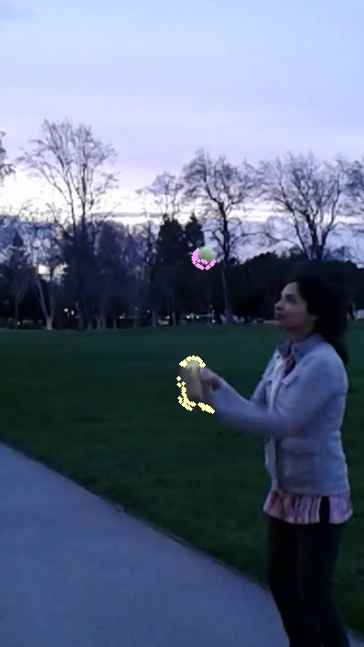
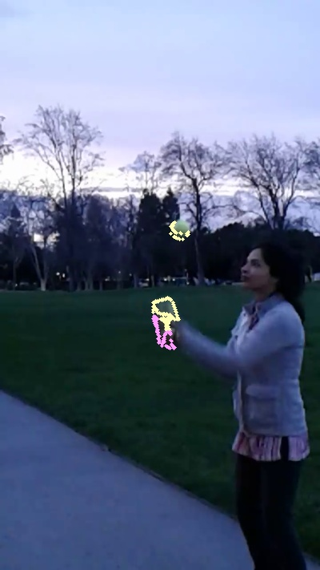

Tracking movement of particles is useful in different areas of materials development.  

These results are from a video of me juggling.  The green balls are captured based on color discrimination.  

As a next step, I am going to try using dense optical flow to track the moving objects.  
