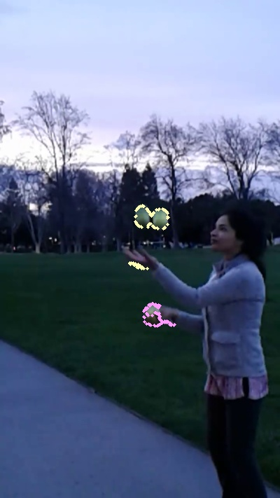
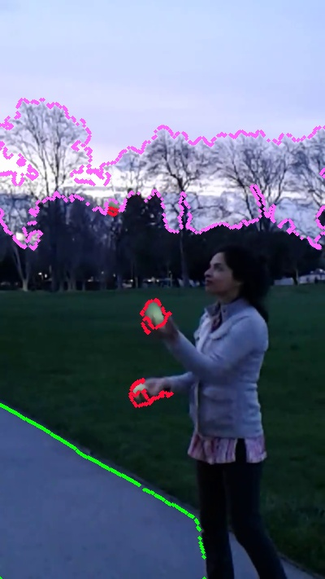

Tracking movement of particles is useful in different areas of materials development.  

These results are from a video of me juggling.  The green balls are captured based on color discrimination.  

As one of the next steps, I am going to try using dense optical flow to track the moving objects. 

Another next step is to use the balls and the sidewalk as training data to make a classifer for moving and non-moving objects in a video.  The classifier will be tested on the horizon of trees.  

